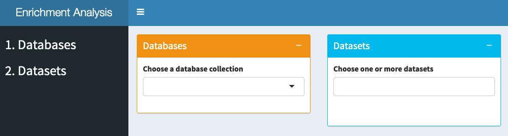
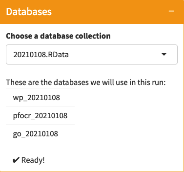
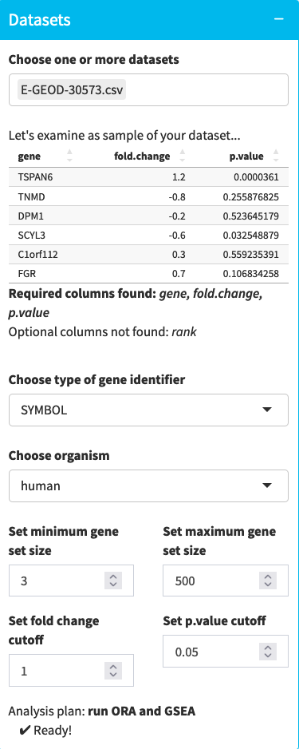
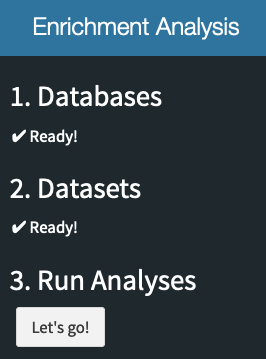
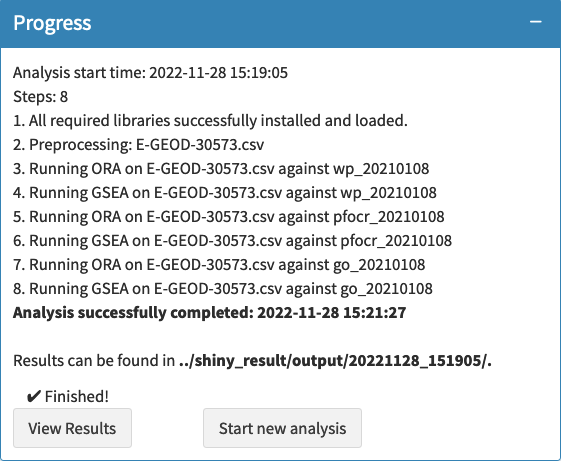
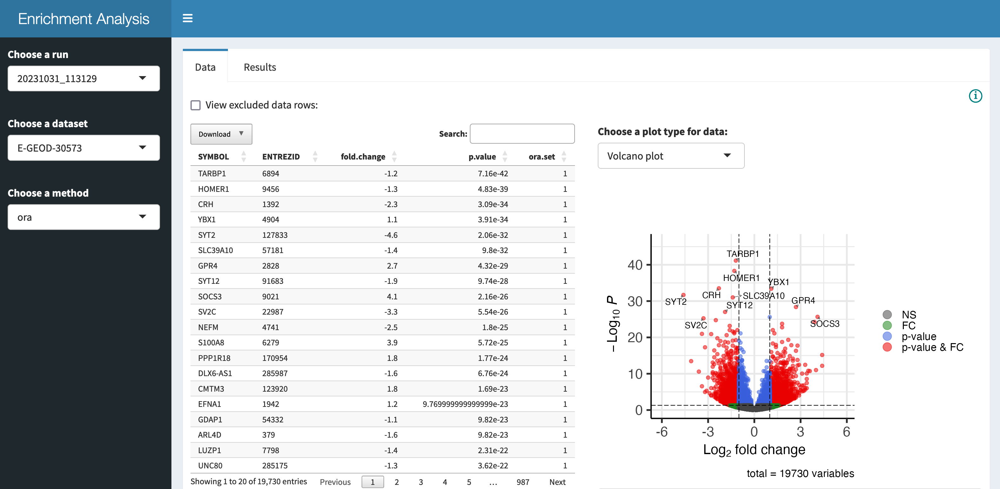

# Interactive Enrichment Analysis

*tldr; Just perform the **bold, bullet list items** below to get up and
running fast.*

## Download

Download this repo, unzip the contents, and and run locally to perform
enrichment analysis for multiple datasets across multiple public
databases.

-   [**Download
    Repo**](https://github.com/gladstone-institutes/Enrichment_Analysis/archive/refs/heads/main.zip)
-   **Find and open the downloaded ZIP file,
    `Enrichment_Analysis-main.zip`.**

*Advanced: Alternatively, you can clone the repo and periodically
perform `git pull` to update the code and database collections.*

## Launch

The main shiny app `shiny_run` will launch an interactive session.

-   **Either open `shiny_run/app/global.R` in RStudio and launch via the
    `Run App` menu *(`Run External` is recommended)*. Or, navigate by
    command line into your local copy of the repo and launch via:**
```
    runApp(appDir = "shiny_run/app", launch.browser = TRUE)
```



## Databases

A collection of public databases is provided and updated monthly as a
datestamped (YYYYMMDD) RData file, e.g., `20210108.RData`. [Cite](#how-to-cite)
and provide this file for reproducible research. Download updated
versions (or perform `git pull`) to access the latest content from
public databases.

-   **In the *Databases* panel, choose a database collection.**

The app will take a moment to load the databases, check their validity,
and list them for your review. This step is complete when you see ✔
**Ready!**



*Advanced: If you want to construct your own database collection, then
add one or more GMT files to `shiny_run/databases/gmts/` and choose
BUILD NEW DATABASE in the Databases panel.*

*Pro-tip: Between projects, be sure to update your RData or GMT files as
new versions are released.*

## Datasets

A sample dataset `E-GEOD-30573.csv` ([Voineagu
2011](https://europepmc.org/article/MED/21614001)) is provided to
illustrate the required format. *A `gene` column is always required.*
Columns named `rank`, `p.value`, and `fold.change` are also recognized
for additional analysis options. All other columns are ignored.

-   **In the *Datasets* panel, choose one more more datasets to analyze
    or choose ADD NEW DATASETS to upload your own CSV files.**

You can choose as many dataset files as you like as long *as they are
all of the same format*. Datasets with different formats should be
analyzed in separate runs.

#### Format

The supported formats include:

-   a simple list of genes (for ORA only)
-   a list of genes with a `rank` column (for GSEA only)
-   a list of genes with a `p.value` column (for GSEA and ORA)
-   a list of genes with `p.value` and `fold.change` columns (for GSEA
    and ORA)

*Caution: For a given run, all datasets are assumed to have the same
format. If you have different types of dataset files (per the list
above), then you should run them in separate batches.*

#### Preview and Options

The app will display a preview of the first few rows of the first chosen
dataset along with the required and optional columns it could detect
(see table and subsequent message in screenshot).



**Identifiers**

Supported gene identifiers include SYMBOL, ENSEMBL, ENTREZID, and
UNIPROT, by default. But it is trivial to add support for [any orgDb
keytypes](http://yulab-smu.top/biomedical-knowledge-mining-book/useful-utilities.html).
Simply edit the `supported.idTypes` list in the "Defaults and
Parameters" section of `shiny_run/app/global.R`.

**Organisms**

Supported species include human, mouse and rat, by default. But it is
trivial to add support for [any orgDb
species](https://bioconductor.org/packages/release/BiocViews.html#___OrgDb).
Simply edit the `supported.org` list in the "Defaults and Parameters"
section of `shiny_run/app/global.R`.

**Gene set min/max**

These options are defined by
[clusterProfiler](http://bioconductor.org/packages/release/bioc/manuals/clusterProfiler/man/clusterProfiler.pdf#Rfn.enricher.1)
and are used to prune the databases, restricting the gene sets
considered in the analysis based on their size, e.g., excluding gene
sets with fewer than 3 genes or more than 500 genes.

**ORA Cutoffs**

If ORA is to be performed, then `fold.change` and `p.value` cutoffs must
be supplied. These are used to define the subset of significantly
changed genes to test against all other genes in the dataset.

At the bottom of the panel, the "Analysis plan" will state which
analyses will be performed. The app performs all possible analyses. This
step is complete when you see ✔ **Ready!**

## Run Analyses

When *Databases* and *Datasets* are loaded and verified, a third step
will appear in the side panel.



If the analysis plan looks good to you, including all the parameter
choices, then...

-   **Click `Let's go!`**

The initial set of panels will collapse and a new *Progress* panel will
open along with a progress bar in the lower-right corner.



The *Progress* panel will enumerate the steps and report any errors
along the way. In general, the steps include: installing required R
libraries, preprocessing of each dataset, and performing ORA and/or GSEA
for each dataset against each database.

It will also report the start and finish times for the run, and the
location of the output folder that is given a unique timestamp-based
name to support multiple independent runs.

This step is complete when you see ✔ **Finished!**

<span align="left">
Two buttons will be presented at the completion of each run:
</span>

-   **Click `View Results` to launch a shiny app for interactively
    viewing results, or click `Start new analysis` to reset the app for
    another run.**

*Advanced: Results are organized under a run-specific folder named by
timestamp with subfolders for `gsea` and `ora` results, each of which
includes a folder of `plots`. Results include TSV and XLSX tables of
enriched terms and pathway, as well as RDS versions of the complete
input and output for each clusterProfiler run and a log file. Plots
include volcano, dot, cnet, heatmap, upset, and more.*

## View Results

A second shiny app is allows you to interactively explore results and
download individual files. Its side panel is organized in the same way
as the output folders.



#### **Data Tab**

For a given run, dataset and method (see side panel), the *Data* tab
displays the processed input data as a table (left) and volcano plot
(right). The table is paginated and supports search, filtering and
download as Excel, CSV or to clipboard. The volcano plot uses the
user-specified `fold.change` and `p.value` cutoffs (for ORA) and can
also be downloaded. A checkbox near the top of the panel allows you to
also view the genes that were excluded from the analysis, e.g., due to
failed identifier mapping.

*Pro-tip: View the excluded data rows to assess whether the exclusions
are resolvable (e.g., fixing identifiers in your dataset CSV) and
substantial (e.g., a lot of significant genes per the volcano plot).*


#### **Results Tab**

Per selected database (see the top drop-down menu), the *Results* tab
displays a table of enriched terms and pathways, a plot of top results
(left), and a plot of a selected result (right) from the table (above).
The table is paginated and supports selection, search, filtering and
download as Excel, CSV or to clipboard. The plots for top results
include dot (by Gene Ratio or by Count), emap, concept networks, etc.,
and can also be downloaded. The plots for individual, selected results
include GSEA score (for GSEA), database-specific views and linkouts, and
more, and can also be downloaded.

*Pro-tip: Navigate between GSEA and ORA methods (side panel) while
viewing the results for a particular database to explore hits in common
(and unique) to the different methods.*

## Publishing

You are free to use all the files produced by this tool in your research
and publications. Again, an initial set of plots, tables and RDS files
is automatically generated in `shiny_result/output/…` and you can also
download individual tables and plots from the interactive app.

In addition, the project is structured in a way to facilitate sharing
your results along with the interactive app! All the necessary files are
maintained under the `shiny_result` folder. Share this folder (e.g., as
a zip file, Dropbox or Box), or upload it to a cloud-hosted service
(e.g., [shinyapps.io](https://www.shinyapps.io/)) and share a simply
URL. ***This is the best way to publish your enrichment results,
allowing other researchers to browse your full results in spite of the
limited space in publications.***

## How to Cite 

#### Databases

The databases provided here each deserve a citation if you decide to
publish or share your enrichment analysis results.

> 1.  Martens M, Ammar A, Riutta A, Waagmeester A, Slenter DN, Hanspers
>     K, Miller RA, Digles D, Lopes EN, Ehrhart F, Dupuis LJ, Winckers
>     LA, Coort SL, Willighagen EL, Evelo CT, Pico AR, Kutmon M.
>     **WikiPathways: connecting communities** *Nucleic Acids Research*,
>     (2021), Volume 49, Issue D1, 8 January 2021, Pages D613--D621,
>     doi: [10.1093/nar/gkaa1024](https://doi.org/10.1093/nar/gkaa1024)
> 2.  Hanspers K, Riutta A, Summer-Kutmon M, Pico AR*.* **Pathway
>     information extracted from 25 years of pathway figures.** *Genome
>     Biol* **21**, 273 (2020). doi:
>     [10.1186/s13059-020-02181-2](https://doi.org/10.1186/s13059-020-02181-2)
> 3.  Gene Ontology Consortium. **The Gene Ontology resource: enriching
>     a GOld mine.** *Nucleic Acids Res*. 2021;49(D1):D325-D334. doi:
>     [10.1093/nar/gkaa1113](https//doi.org/10.1093/nar/gkaa1113)

#### Analysis Methods

The enrichment analysis implementations were implemented by Guangchuang
Yu in the
[clusterProfiler](http://bioconductor.org/packages/release/bioc/html/clusterProfiler.html)
R package. Please cite this:

> Wu T, Hu E, Xu S, Chen M, Guo P, Dai Z, Feng T, Zhou L, Tang W, Zhan
> L, Fu x, Liu S, Bo X, Yu G (2021). **clusterProfiler 4.0: A universal
> enrichment tool for interpreting omics data.** *The Innovation*,
> **2**(3), 100141. doi:
> [10.1016/j.xinn.2021.100141](https://doi.org/10.1016/j.xinn.2021.100141).

#### Interactive Tools

The interactive Shiny applications used to setup, launch and view the
results of enrichment analyses was developed by the Gladstone Institutes
Bioinformatics Core. Please cite this repo and consider acknowledging
our group if these tools prove useful.

> <https://github.com/gladstone-institutes/Enrichment_Analysis>
>
> *We thank the Gladstone Bioinformatics Core for their interactive
> enrichment analysis tools.*
